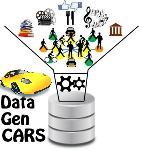

<div style="text-align:center"></div>

## Overview

AUTO_DataGenCARS is a complete Python-based synthetic dataset generator for the valuation of Traditional Recommendation Systems (RS) and Context-Aware Recommendation Systems (CARS).

The generator presents features such as:

- A flexible definition of user profiles, use, item and context schemas.
- A realistic generation of ratings (implicit and explicit) and attributes of items.
- The possibility to mix real and synthetic datasets.
- Functionalities to analyze existing datasets as a basis for synthetic data generation.
- Support for the automatic mapping between item schemas and Java classes.
- Analysis and evaluation of RS anc CARS with generated datasets.

It was designed with the following purposes:

* Generate a synthetic dataset:
  - Explicit ratings
  - Implicit ratings
* Pre-process a dataset:
  - Replace NULL values
  - Generate a user profile (manual and automatic)
  - Replicate dataset
  - Extend dataset
  - Recalculate ratings
  - Cast rating
  - Data converter
* Analysis a dataset:
  - Visualization:
    - user
    - item
    - context `<optional>`
    - behavior `<optional>`
    - rating
  - Evaluation:
    - RS: collaborative filtering and content-based information
    - CARS: pre-filtering, post-Filtering and contextual modeling paradigms

## Demo
AUTO-DataGenCARS has a user-freindly [demo](https://193.144.226.31/streamlit) based on Streamlit.
To use it the following credentials will be required.

- **user**: `autodatagencars`
- **password**: `Qxwsx3py`

## Installation:
With pip:
```python
    $ pip install numpy
    $ pip install scikit-surprise
```
With conda:
```python
    $ conda install -c conda-forge scikit-surprise
```

For the latest version, you can also clone the repo and build the source:
```python     
    $ git clone https://git.itainnova.es/bigdata/misc/auto_datagencars.git  
```

## Requirements
The libraries used in this project with its respective versions can be seen in `environment.yml`.

## License
This project is licensed under the [BSD 3-Clause](https://opensource.org/licenses/BSD-3-Clause) license, so it can be used for pretty much everything, including commercial applications.

Open source license: If you are creating an open source application under a license compatible with the GNU GPL license v3 you may use SAME under its terms and conditions.

## Reference
Please make sure to cite the [paper](https://www.sciencedirect.com/science/article/pii/S157411921630270X) if you use
AUTO-DataGenCARS for your research:

```
@article{mc2017datagencars,
          doi = {10.1016/j.pmcj.2016.09.020},             
          year = {2017},
          note = {Special Issue IEEE International Conference on Pervasive Computing and Communications (PerCom) 2016},
          publisher = {Elsevier},
          volume = {38},
          number = {2},
          pages = {516-541},
          issn = {1574-1192},
          author = {María del Carmen Rodríguez-Hernández and Sergio Ilarri and Ramón Hermoso and Raquel Trillo-Lado},
          title = {DataGenCARS: A generator of synthetic data for the evaluation of context-aware recommendation systems},
          journal = {Pervasive and Mobile Computing}
        }
```

## Contributors

The following persons have contributed to AUTO-DataGenCARS:

- María del Carmen Rodríguez Hernández - [mcrodriguez@itainnova.es](mcrodriguez@itainnova.es)
- Sergio Ilarri - [silarri@unizar.es](silarri@unizar.es)
- Raquel Trillo Lado - [raqueltl@unizar.es](raqueltl@unizar.es)
- Ramón Hermoso - [rhermoso@unizar.es](rhermoso@unizar.es)
- Marcos Caballero Yus - [mcaballero@itainnova.es](mcaballero@itainnova.es)
- Beatriz Franco García - [bfranco@itainnova.es](bfranco@itainnova.es)
